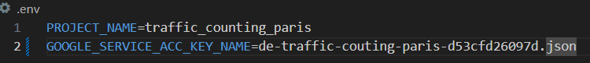
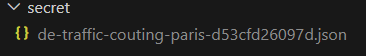
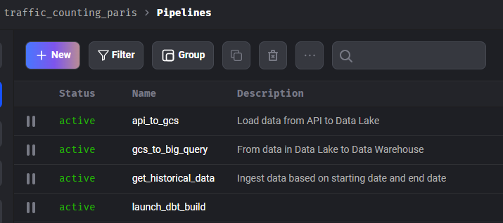
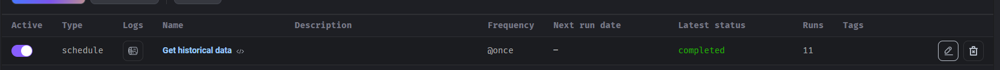
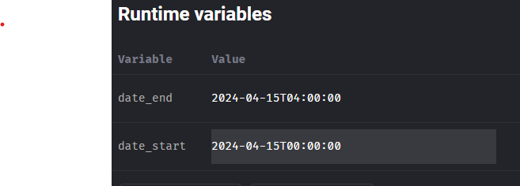

# Traffic counting Paris

This is a capstone project, developed under the scope of the [Data Engineer Zoomcamp by DataTalksClub](https://github.com/DataTalksClub/data-engineering-zoomcamp).

## Project & problem description

This project builds an automated end-to-end data pipeline that pull data hourly from Paris Traffic Counting sensors in order to have an idea of the traffic in Paris.

First, through Terraform,  the project infrastructure is set up. Then, with orchestrator Mage AI, this project first pull data from API and load into a data lake (GCP Bucket). Then data are loaded into a Data Lake (Big Query). The data are cleaned and transformed with DBT inside the warehouse. Finally the data feed a dashboard (Looker/Google Data Studio)to monitor traffic in Paris.


### Dataset

I used a dataset from [OpenData.paris.fr](https://opendata.paris.fr/explore/dataset/comptages-routiers-permanents/information/?disjunctive.libelle&disjunctive.etat_trafic&disjunctive.libelle_nd_amont&disjunctive.libelle_nd_aval) on traffic counting. This dataset is updated every day at 3 a.m. on data collected from the day before.
This website has an API where we can fetch data. However, it has a limit of 10 000 data per API call. This is why I chose an hourly batch ingestion, ingesting data every hour from the day before. Like the 18th april at 10 a.m. You'll be fetching that from the 17th at the same hour UTC. 

This dataset contains : 
| Attribute         | Type      | Definition                                                                                          |
|------------------|-----------|-----------------------------------------------------------------------------------------------------|
| iu_ac            | INTEGER   PRIMARY KEY|  Unique identifier of the traffic data arc; to be matched with the "iu_ac" attribute of the reference. |
| libelle          | TEXT      | Label of the road or road section modeled by the arc                                                |
| iu_nd_amont      | INTEGER   | Unique identifier of the upstream node of the arc                                                    |
| libelle_nd_amont | TEXT      | Label of the upstream node of the arc                                                                |
| iu_nd_aval       | INTEGER   | Identifier of the downstream node of the arc                                                         |
| libelle_nd_aval  | TEXT      | Label of the downstream node of the arc                                                               |
| t_1h             | TIMESTAMP WITHOUT TIMEZONE PRIMARY KEY | Hourly timestamp (end of elaboration period) in ISO format: YYYY-MM-DD HH:MM:SS. For example, the timestamp "2019-01-01 01:00:00" refers to the period from January 1, 2019, at 00:00 to January 1, 2019, at 01:00. |
| q                | REAL      | Flow (number of vehicles counted during the hour)                                                    |
| k                | REAL      | Occupancy rate (percentage of time the measurement station is occupied by vehicles in the hour).
| etat_trafic      | INTEGER   | Qualification of the traffic state: Unknown, Fluid, Pre-saturated, Saturated, Blocked                                                                                         |
| etat_barre       | INTEGER   | State open or not (barred, unknown, or invalid) to traffic on the arc:                                Unknown,  Open, Barred, Invalid                                                                                         |
| Dessin           | TEXT      | Schematic drawing of the arc for the corresponding "iu_ac" identifier and "t_1h" timestamp.        |


I also use a [referential geographical dataset](https://parisdata.opendatasoft.com/explore/dataset/referentiel-comptages-routiers/information/?sort=libelle_nd_aval&basemap=jawg.dark&location=13,48.60101,2.62923). It contains geographical position of the sensors used. As it is rarely updated, I chose to put is as a [seed](./dbt/seeds/geographical_referential_raw.csv) in dbt.

### Technologies : 
- Docker for running services
- Terraform for managing infrastructure in the cloud
- Mage AI for orchestrating the data flow.
- Google Cloud Storage for data lake storage
- Google Cloud BigQuery for data warehousing
- DBT for data transformation
- Looker/Google Data Studio to display and monitor the data

### Pipeline description


#### Infrastructure as a code & Cloud
Terraform has enabled me to build buckets and BQ datasets.

#### Data ingestion 
Data are ingested hourly with API pull request orchestrated by MAGE.
To re-iterate, the dataset is updated daily however API enables us only to pull up to 10 000 records. An hour of records is about 9 500 records this is why I chose hourly ingestion instead of daily ingestion.

#### Data warehousing
My data warehouse is BigQuery. The final table is partitioned on date time column of the data collecition (t_1h) and clustered by label of road (libelle) as it makes the more sense to partition data by date and as they are multiple sections for a single road, I clustered on label or road.

#### Data Transformations
Data Transformations are done using DBT and orchestrated by MAGE. I cleaned null records and also created a [geography column](https://cloud.google.com/bigquery/docs/geospatial-data?hl=fr) so that I'm able to display roads on a map on the dashboard. Also I created a unique final table, by joining sensor data and referential data.

#### Dashboard
On this [dashboard](https://lookerstudio.google.com/reporting/ec19f889-5750-4f6b-af04-e4fada89543d), one can see : 
- The latest traffic state
- A heat map of the record count per road. 
- Road name sorted by average occupation rate
- Average traffic volume per hour
- Average occupation rate per hour
- Repartition of traffic state per hour
- Global repartition of the traffic state

On the heat map we can observe that entry point to Paris have a high record count which makes sense as they are where people go in and out of paris. Those entry points roads are actually the first on the chart showing the road name sorted by average occupation rate.

Traffic state as of late, displayed by the first map, is aligned with the 2 chats of average traffic volume and average occupation rate per hour. When it is around 5 p.m - 6 p.m. we can see a lot of saturated roads, especially on the [Boulavard Périphérique](https://en.wikipedia.org/wiki/Boulevard_P%C3%A9riph%C3%A9rique). It makes sense as it is when people leave work, and the Boulevard Périphérique is a Boulevard enabling people to go in, out and around Paris. 

## Reproducibility

### Prerequisites
- WSL or any Linux system
- [Docker Desktop](https://www.docker.com/products/docker-desktop/)
- [Install Terraform](https://developer.hashicorp.com/terraform/install)


### Set up the project

1. Create a [Google Cloud Account](https://cloud.google.com/?hl=fr)

2. [Create a Google Cloud Project through your Google Cloud dashboard](https://developers.google.com/workspace/guides/create-project?hl=fr)

3. Create a Service Account
1. Giving it these roles :
- BigQuery Admin
- Storage Admin
- Storage Object Admin
2. Save the JSON Key
3. Add it to the folder "secret" of the project
4. In .env put the name of the json key as the value of GOOGLE_SERVICE_ACC_KEY_NAME



### Build the project
Make sure you have launched docker desktop.

Go at the root of the project and in terminal type this command to build Google resources
```bash
make terraforum up
```

Then type this command to build and launch Docker container
```bash
make docker 
```
If you want to destroy the resources type the following command
```bash
make terraforum down
```

### Collect Data

When you first launch the docker, a first batch of data is downloaded. It corresponds to the data from yesterday, at the same hour UTC.
As long as you have your container running, you'll be fetching yesterday's data each hour.

If you'd like to collect historical data, there is a special pipeline.

1. First access all your pipelines at [http://localhost:6789/pipelines](http://localhost:6789/pipelines?_limit=30&_order_by[]=Name&sort_column_index=2&sort_direction=asc)


2. Click on pipeline get_historical_data

3. Once there, you see a trigger, click on the pen on the left to modify the trigger


4. On the left, there is a panel where there are 2 variables : date_start and date_end. Modify those variables to fetch data from those dates. **BE CAREFUL** not to have a too large time window, your kernel could crash and the API could block you because you exceeded the limit for the day.


5. Save the trigger by clicking the button "Save changes" on the left 

6. Launch the trigger by clicking button "Run@Once"


# Take-Home note
First of all, I really liked this project and the bootcamp as a whole.

I think I could have improved this project :
- Deploy it fully on the cloud, not using docker and only using Google or any cloud
- Daily ingestion would've make more sense but amount of pulled data is limited by the API. 